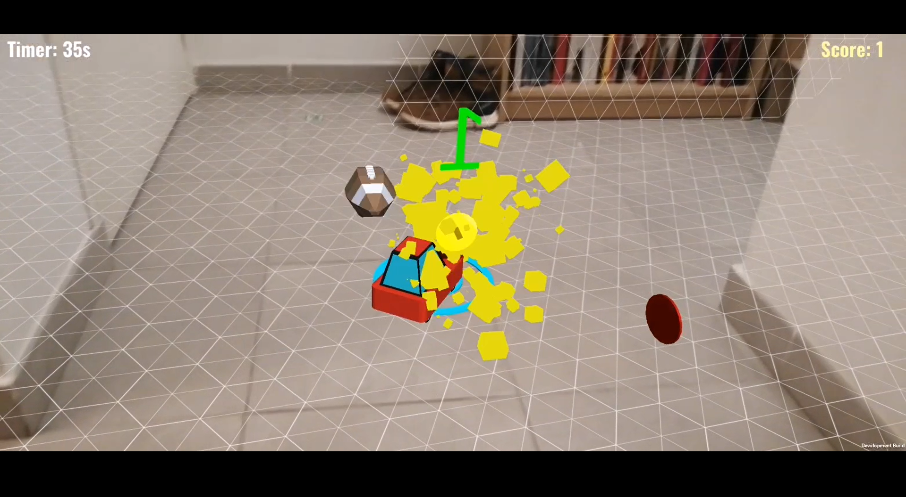
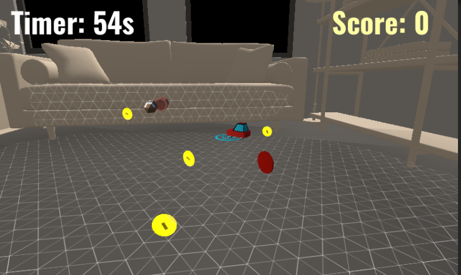

# cARplayground
Projet de jeux AR dans le cadre de l'UE Projet 3D du M2 Informatique Parcours IMAGINE 2020-2022

- Pitch: Arcade conduite de véhicule incrusté dans le monde réel 
- Objectif : Avoir le plus haut score dans un temps imparti 
- Gameplay : Action-Simulation 
- Inspiration :  Mario Kart Live 

Screenshot sur Smartphone

Outils : 
- Unity 2020.3.19f1 
- UnityMars (Version d'essai)

Liens: 
- [Presentation Projet](https://docs.google.com/presentation/d/1qSi1qAcqr7PZi8k2_Hc-mUTOqZSs7gy7d93RtJZGBhE/edit?usp=sharing)
- [Vidéo sous Unity Mars](https://youtu.be/JkN83K_6kZ4)
- [Vidéo sur Smartphone (Honor8X)](https://youtu.be/W4Dvlz6BN0k)

Screenshot sous Unity Mars 
